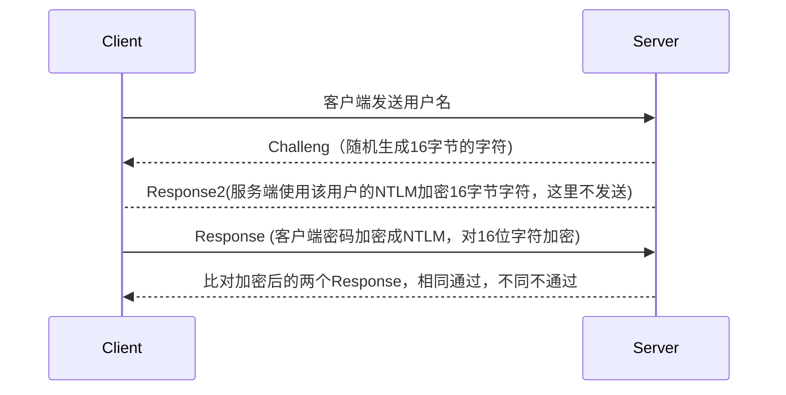

## Windows密码

密码存储于 SAM 文件中
路径：
`%systemroot%\system32\config\SAM`


当我们登录系统的时候,系统会自动地 读取SAM文件中的“密码”与我们输入的“密码”进行比对，如果相同，证明认证成功！

## NTLM（NT LAN Manger）

* NTLMHash是支持Net NTLM认证协议及本地认证过程中的一个重要参与物，其长度为32位，由数字与字母组成。 
* **Windows本身不存储用户的明文密码**，它会将用户的明文密码经过加密算法后存储在SAM数据库中。 
* 当用户登录时，将用户输入的明文密码也加密成NTLMHash，与 SAM数据库中的NTLMHash进行比较。NTLMHash的前身是LM Hash，目前基本淘汰。

## LM Hash

### 代码实现
```python
#coding=utf-8
import re
import binascii
from pyDes import *
def DesEncrypt(str, Des_Key):
    k = des(binascii.a2b_hex(Des_Key), ECB, pad=None)
    EncryptStr = k.encrypt(str)
    return binascii.b2a_hex(EncryptStr)

def group_just(length,text):
    # text 00110001001100100011001100110100001101010011011000000000
    text_area = re.findall(r'.{%d}' % int(length), text) # ['0011000', '1001100', '1000110', '0110011', '0100001', '1010100', '1101100', '0000000']
    text_area_padding = [i + '0' for i in text_area] #['00110000', '10011000', '10001100', '01100110', '01000010', '10101000', '11011000', '00000000']
    hex_str = ''.join(text_area_padding) # 0011000010011000100011000110011001000010101010001101100000000000
    hex_int = hex(int(hex_str, 2))[2:].rstrip("L") #30988c6642a8d800
    if hex_int == '0':
        hex_int = '0000000000000000'
    return hex_int

def lm_hash(password):
    # 1. 用户的密码转换为大写，密码转换为16进制字符串，不足14字节将会用0来再后面补全。
    pass_hex = password.upper().encode("hex").ljust(28,'0') #3132333435360000000000000000
    print(pass_hex) 
    # 2. 密码的16进制字符串被分成两个7byte部分。每部分转换成比特流，并且长度位56bit，长度不足使用0在左边补齐长度
    left_str = pass_hex[:14] #31323334353600
    right_str = pass_hex[14:] #00000000000000
    left_stream = bin(int(left_str, 16)).lstrip('0b').rjust(56, '0') # 00110001001100100011001100110100001101010011011000000000
    right_stream = bin(int(right_str, 16)).lstrip('0b').rjust(56, '0') # 00000000000000000000000000000000000000000000000000000000
    # 3. 再分7bit为一组,每组末尾加0，再组成一组
    left_stream = group_just(7,left_stream) # 30988c6642a8d800
    right_stream = group_just(7,right_stream) # 0000000000000000
    # 4. 上步骤得到的二组，分别作为key 为 "KGS!@#$%"进行DES加密。
    left_lm = DesEncrypt('KGS!@#$%',left_stream) #44efce164ab921ca
    right_lm = DesEncrypt('KGS!@#$%',right_stream) # aad3b435b51404ee
    # 5. 将加密后的两组拼接在一起，得到最终LM HASH值。
    return left_lm + right_lm

if __name__ == '__main__':
    hash = lm_hash("123456")
```

## 生成NTLM Hash

* NTLM


### 代码实现(Python2)
```python
# coding=utf-8

import codecs
import sys

from Crypto.Hash import MD4


def UnicodeEncode(str):
    b = []
    l = int(len(str) / 2)
    for i in range(l):
        b.append((str[i * 2:2 * i + 2]) + '00')
    return ''.join(b)


def Md4Encode(str):
    h = MD4.new()
    h.update(str.decode('hex'))
    return h.hexdigest()


if __name__ == '__main__':
    passwd = sys.argv[1]
    print('Input: ' + passwd)

    # 转hex
    passwd = codecs.encode(passwd.encode(), 'hex_codec').decode()
    print('Hex: ' + passwd)

    # 转Unicode
    passwd = UnicodeEncode(passwd)
    print('Unicode: ' + passwd)

    # 转md4
    NTLMhash = Md4Encode(passwd)
    print('NTLMhash: ' + NTLMhash)
```
### 更简单的一句话
```
python2 -c 'import hashlib,binascii; print binascii.hexlify(hashlib.new("md4", "p@Assword!123".encode("utf-16le")).digest())'
```

## 本地认证流程

* Windows LogonProcess（即 winlogon.exe)，是Windows NT 用户登陆程序，用于管理用户登录和退出。 
*  LSASS用于微软Windows系统的安全机制。它用于本地安全和登陆策略。


## 认证流程





## NTLM v1 和 v2 的区别

* NTLM v1与NTLM v2最显著的区别就是Challenge与加密算法不同， 共同点就是加密的原料都是NTLM Hash。 
* NTLM v1 的Challenge有8位，NTLM v2的Challenge为16位。 
* NTLM v1的主要加密算法是3DES，NTLM v2的主要加密算法是 HMAC-MD5。

